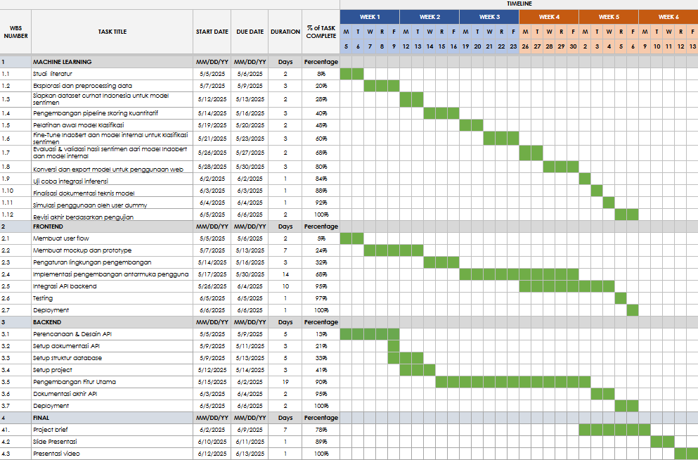

**Dataset : https://drive.google.com/file/d/1J5gPUtvkxBYkEfk1XN_hqNU22WTqvwbY/view?usp=sharing**

**Project Plan**

**\[SEHATI: Sistem Evaluasi Kesehatan Mental Terintegrasi Berbasis
AI\]**

**ID Tim**: **[CC25-CF098]{.mark}**

**Anggota Tim**:

1.  \(ML\) [MC314D5X1630]{.mark} - [Nur Salamah Azzahrah]{.mark} -
    > Universitas Singaperbangsa Karawang - \[Aktif\]

2.  \(ML\) [MC404D5Y0059]{.mark} - [Zidan Muhammad Ikvan]{.mark} -
    > Politeknik Negeri Batam - \[Aktif\]

3.  \(ML\) [MC015D5Y0309]{.mark} - [Yoga Sulistiyo Widodo]{.mark} -
    > Universitas Negeri Yogyakarta- \[Aktif\]

4.  (FEBE) [FC314D5Y1609]{.mark} - [Sopian Syauri]{.mark} - Universitas
    > Singaperbangsa Karawang - \[Aktif\]

5.  (FEBE) [FC314D5X1631]{.mark} - [Alfia Meilani Putri]{.mark} -
    > Universitas Singaperbangsa Karawang - \[Aktif\]

6.  (FEBE) [FC558D5Y0538]{.mark} - [Ary Kurnia]{.mark} - Universitas
    > Handayani Makassar- \[Aktif\]

**Tema yang Dipilih:**

Health Innovation

**Judul Proyek:**

SEHATI: Sistem Evaluasi Kesehatan Mental Terintegrasi Berbasis AI.

**Ringkasan Eksekutif/Abstrak:**

Kesehatan mental merupakan aspek penting dalam kehidupan setiap
individu, namun masih sering diabaikan akibat stigma sosial dan
terbatasnya akses terhadap layanan profesional. Banyak orang, khususnya
generasi muda, merasa takut atau malu untuk berkonsultasi dengan
psikolog karena kekhawatiran akan penilaian negatif dari lingkungan.
Kondisi ini menimbulkan kebutuhan akan solusi yang bersifat privat,
mudah diakses, dan berbasis teknologi.

SEHATI (Sistem Evaluasi Kesehatan Mental Terintegrasi Berbasis AI)
merupakan platform web inovatif yang memungkinkan pengguna melakukan
penilaian awal terhadap kondisi kesehatan mental mereka secara mandiri.
Melalui formulir self-assessment yang dirancang berdasarkan indikator
psikologis terpercaya, data pengguna akan dianalisis oleh model berbasis
machine learning yang kami kembangkan sendiri untuk mengklasifikasikan
tingkat kesehatan mental, memberikan interpretasi kondisi, serta saran
langkah lanjutan.

Meskipun SEHATI dapat menjadi sarana awal untuk mengenali gejala
gangguan mental, platform ini bukanlah pengganti diagnosis profesional.
Konsultasi dengan psikolog tetap sangat disarankan untuk memastikan
kondisi kesehatan mental secara menyeluruh.

Proyek ini dikembangkan dengan pendekatan design thinking, dimulai dari
pemahaman empatik terhadap isu yang dihadapi masyarakat, perumusan
solusi, hingga implementasi teknologi yang inklusif. SEHATI diharapkan
dapat meningkatkan kesadaran diri, serta mendorong upaya preventif dalam
menjaga kesehatan mental setiap individu.

**Bagaimana tim Anda menemukan proyek ini?**

Proyek SEHATI lahir dari diskusi tim lintas disiplin yang menyoroti
meningkatnya kasus gangguan kesehatan mental di kalangan remaja dan
dewasa muda dalam beberapa tahun terakhir. Berdasarkan survei
Indonesia-National Adolescent Mental Health Survey (I-NAMHS) tahun 2022,
sekitar 34,9% atau 15,5 juta remaja Indonesia mengalami masalah
kesehatan mental, namun hanya 2,6% yang mendapatkan layanan profesional.
Selain itu, berbagai media nasional juga sering memberitakan kasus
depresi hingga tindakan bunuh diri yang menunjukkan urgensi penanganan
kesehatan mental secara lebih terbuka dan sistematis. Melalui analisis
berita dan referensi terpercaya, kami menyadari perlunya sebuah sistem
evaluasi yang aman, anonim, dan berbasis teknologi. Dari sinilah ide
SEHATI berkembang.

**Ruang Lingkup & Hasil Proyek:**

Ruang Lingkup:

Proyek SEHATI mencakup pengembangan sistem evaluasi kesehatan mental
berbasis web yang terdiri dari:

-   Pengembangan platform AI berbasis web.

-   Perancangan dan pelatihan model klasifikasi kesehatan mental
    > berbasis Deep Learning yang dikombinasikan dengan metode Transfer
    > Learning.

-   RESTful API backend diimplementasikan menggunakan Node.js dan
    > framework Hapi.js untuk mendukung pengelolaan data pengguna serta
    > proses inferensi model.

-   Pembangunan antarmuka frontend responsive dengan React (Vite) dan
    > Tailwind CSS.

-   Fitur utama yang dikembangkan: Penilaian kesehatan mental
    > berdasarkan formulir self-assessment dan analisis hasil evaluasi
    > melalui metode analisis sentimen menggunakan beberapa model
    > seperti IndoBert, atau model-model internal berdasarkan data yang
    > user kirim sebagai bentuk ungkapan perasaan yang sedang dialami
    > melalui form text sesudah pengisian kuesioner.

-   Fitur tambahan (opsional): artikel edukatif dan rekomendasi saran
    > tindakan preventif.

-   Penekanan bahwa SEHATI hanya berfungsi sebagai alat bantu deteksi
    > dini dan bukan alat diagnosis profesional yang dapat menggantikan
    > para pekerja profesional dibidang kesehatan mental.

**Jadwal Proyek:**

{width="6.5in" height="4.277777777777778in"}

Informasi lebih lengkapnya [[di
sini]{.underline}](https://docs.google.com/spreadsheets/d/1S2wH-CW2vp5H3-BHTqrbGN_FG5h36mvfoPLxgDKf_K4/edit?usp=sharing).

**Berdasarkan pengetahuan tim Anda, alat/IDE/Library, dan sumber daya
apa yang akan digunakan untuk menyelesaikan masalah?**

Daftar alat:

1.  IDE :

    a.  Kaggle Notebook

    b.  Visual Studio Code

2.  Library :

    a.  Machine Learning

        i.  Sastrawi

        ii. NLTK

        iii. Transformers

        iv. Pandas

        v.  Numpy

        vi. Pyplot

        vii. Seaborn

        viii. Scikit Learn

    b.  Frontend

        i.  React

        ii. Vite

        iii. Axios

        iv. Tailwind CSS

    c.  Backend

        i.  Hapi.js

        ii. Bcrypt

        iii. TensorFlow.js

        iv. mysql2

        v.  ESLint

        vi. Dotenv

        vii. Nodemon

        viii. winston

        ix. Jest

        x.  Swagger/OpenAPI

3.  Platform

    a.  Google Cloud Platform

    b.  GitHub

    c.  Figma

    d.  Postman

4.  API :

    a.  Machine learning

    b.  Full stack Developer

5.  Sumber Daya

    a.  Cloud Computing

**Berdasarkan pengetahuan dan eksplorasi, apa yang tim Anda butuhkan
untuk dukungan?**

1.  Daftar item:

    a.  Internet

    b.  Dataset

    c.  Icon packs

2.  Mentor

3.  Data

4.  Sumber daya pendukung

    a.  Kaggle notebook pro

    b.  Google Cloud Platform Credit

**Berdasarkan pengetahuan dan eksplorasi, informasikan kepada kami
bagian Machine Learning Anda!**

Kami membangun model klasifikasi kondisi kesehatan mental menggunakan
Scikit-Learn, dengan preprocessing teks berbasis Sastrawi dan NLTK.
Model disimpan dalam format tfjs. Dataset diperoleh dari sumber publik
dan telah dilabeli secara manual. Inferensi dilakukan melalui API
sederhana.

**Berdasarkan pengetahuan dan eksplorasi, informasikan kepada kami
bagian Web/Frontend/Backend Anda!**

Kami membangun antarmuka pengguna dengan React dan Vite untuk performa
optimal, Tailwind CSS untuk styling efisien, serta Axios sebagai HTTP
client. Kami menggunakan Hapi.js karena struktur konsisten dan fitur
bawaan seperti manajemen rute, validasi data, dan autentikasi.
Deployment dilakukan di Google Cloud Platform, dengan dokumentasi API
menggunakan Swagger/OpenAPI.

**Berdasarkan perencanaan tim, apakah ada potensi risiko atau masalah
yang dapat menghambat proyek?**

  -----------------------------------------------------------------------
  **Faktor Risiko**                   **Pemecahan masalah**
  ----------------------------------- -----------------------------------
  Manajemen waktu                     Menyusun timeline realistis,
                                      membagi tanggung jawab secara
                                      merata, dan menjaga komunikasi
                                      terbuka.

  Keterbatasan dataset                Mencari dataset tambahan dari
                                      berbagai sumber terpercaya,
                                      melakukan data augmentation untuk
                                      meningkatkan variasi data.

  Keterbatasan resource training      Mengoptimalkan penggunaan platform
                                      seperti Kaggle Notebook dengan
                                      manajemen waktu pemrosesan yang
                                      efisien.

  Kolaborasi virtual                  Menjadwalkan pertemuan rutin,
                                      memanfaatkan tools kolaboratif, dan
                                      membangun komunikasi yang solid
                                      antar anggota tim.
  -----------------------------------------------------------------------

**Catatan/Tambahan lain yang perlu dipertimbangkan dalam aplikasi tim
Anda**

Jika model TensorFlow.js gagal di load maka membangun RESTful API kedua
menggunakan framework Flask dan TensorFlow yang berjalan di lingkungan
Python. API ini digunakan secara khusus oleh API utama untuk mengelola
proses machine learning secara terpisah, sehingga lebih stabil dan
efisien.
